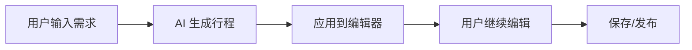

# 📅 AI 生成行程 → Ralendar 日历同步功能讨论总结

> **讨论日期**: 2025-11-14  
> **状态**: 💡 需求分析与技术方案讨论  
> **目标**: 实现商业闭环，打通 AI 生成 → 日历提醒 → 地图导航

---

## 🎯 功能需求

### 核心需求
用户使用 AI 生成旅行计划后，希望可以：
1. ✅ **一键同步到日历**：点击"全部写入日程"按钮
2. ✅ **自动创建日历事件**：将"什么时候去哪儿玩"全部记入 Ralendar
3. ✅ **提前提醒**：到点提前 30 分钟提醒
4. ✅ **地图导航**：提醒时显示地图，方便导航

### 商业价值
- 🔄 **闭环完成**：AI 生成 → 计划保存 → 日程提醒 → 地图导航
- 📱 **用户粘性**：与 Ralendar 深度绑定，提高用户留存
- 🎯 **使用场景**：从计划制定到实际出行的完整链路
- 💰 **变现潜力**：未来可扩展为付费功能（高级提醒、定制地图等）

---

## 📊 当前架构分析

### 1. AI 生成流程（已实现）



**关键代码位置**：
- **前端**: `web/src/views/TripEditorView.vue` → `handleAIApply()` (第 333-410 行)
- **后端**: `backend/api/viewsets/ai_viewset.py` → `generate_trip()`
- **AI 服务**: `backend/utils/ai/ai_service.py` → `generate_trip_plan()`

**AI 返回的数据结构**：
```json
{
  "trip_title": "北京五日游",
  "days_detail": [
    {
      "day_number": 1,
      "date": "2025-11-15",
      "title": "Day 1: 抵达北京",
      "activities": [
        {
          "time": "09:00",
          "duration": "2小时",
          "location": "北京首都国际机场",
          "location_type": "交通",
          "description": "抵达北京，办理入住",
          "coordinates": {"lat": 40.0799, "lng": 116.6031}
        },
        {
          "time": "14:00",
          "duration": "3小时",
          "location": "故宫博物院",
          "location_type": "景点",
          "description": "游览紫禁城，感受皇家气派",
          "coordinates": {"lat": 39.9163, "lng": 116.3972}
        }
      ]
    }
  ]
}
```

---

### 2. Ralendar 集成（已实现）

**关键代码位置**：
- **后端 API**: `backend/api/viewsets/ralendar_viewset.py`
- **客户端**: `backend/utils/external/ralendar_client.py`

**现有功能**：
- ✅ 创建单个事件：`create_event(user_token, event_data)`
- ✅ 批量创建事件：`batch_create_events(user_token, events_list, trip_slug)`
- ✅ 获取事件列表：`list_events(user_token, unionid)`
- ✅ 删除事件：`delete_trip_events(user_token, trip_slug)`

**Ralendar API 数据格式**：
```json
{
  "source_app": "roamio",
  "related_trip_slug": "beijing-trip-2025",
  "events": [
    {
      "title": "北京五日游 - Day 1: 抵达北京",
      "description": "抵达北京，办理入住",
      "start_time": "2025-11-15T09:00:00+08:00",
      "end_time": "2025-11-15T11:00:00+08:00",
      "location": "北京首都国际机场",
      "latitude": 40.0799,
      "longitude": 116.6031,
      "reminder_minutes": 30,
      "email_reminder": true
    }
  ]
}
```

---

### 3. 数据转换需求

**从 AI 数据 → Ralendar 事件**：
```
AI days_detail[].activities[]
  ↓
转换逻辑
  ↓
Ralendar events[]
```

**关键转换点**：
1. **时间转换**：`date + time` → `start_time` (ISO 8601)
2. **结束时间**：`time + duration` → `end_time`
3. **地理坐标**：`coordinates` → `latitude, longitude`
4. **提醒设置**：固定为 30 分钟
5. **事件标题**：`trip_title + " - " + activity.location`
6. **事件描述**：`activity.description + " (来自 Roamio)"`

---

## 🏗️ 技术实现方案

### 方案一：前端转换 + 批量 API（推荐）⭐

**流程**：
```
AI 生成完成
  ↓
用户点击"全部写入日程"
  ↓
前端：转换 AI 数据为 Ralendar 事件格式
  ↓
前端：调用批量创建 API
  ↓
后端：转发到 Ralendar API
  ↓
返回结果，显示同步状态
```

**优点**：
- ✅ 前端控制转换逻辑，灵活性高
- ✅ 可以实时预览将要创建的事件
- ✅ 错误处理清晰（哪些成功，哪些失败）
- ✅ 用户可以看到进度条

**缺点**：
- ⚠️ 前端需要处理复杂的时间计算
- ⚠️ 需要处理时区问题

**实现位置**：
- **前端**: `web/src/views/TripEditorView.vue` → 新增 `syncToRalendar()` 方法
- **前端 API**: `web/src/api/ralendar.js` → 新增 `syncTripToCalendar(tripSlug, events)`
- **后端 API**: `backend/api/viewsets/ralendar_viewset.py` → 新增 `sync_ai_trip()` 方法

---

### 方案二：后端转换 + 批量 API

**流程**：
```
AI 生成完成
  ↓
用户点击"全部写入日程"
  ↓
前端：发送 AI 数据到后端
  ↓
后端：转换 AI 数据为 Ralendar 事件格式
  ↓
后端：调用 Ralendar API
  ↓
返回结果
```

**优点**：
- ✅ 后端统一处理，逻辑集中
- ✅ 时区处理更准确
- ✅ 前端代码简单

**缺点**：
- ⚠️ 前端无法预览
- ⚠️ 错误处理不够灵活

**实现位置**：
- **前端**: `web/src/views/TripEditorView.vue` → 新增 `syncToRalendar()` 方法
- **前端 API**: `web/src/api/ralendar.js` → 新增 `syncAITripToCalendar(tripSlug, aiPlan)`
- **后端 API**: `backend/api/viewsets/ralendar_viewset.py` → 新增 `sync_ai_trip()` 方法
- **后端工具**: `backend/utils/ralendar/ai_trip_converter.py` → 新增转换工具类

---

### 方案三：混合方案（最佳实践）⭐⭐⭐

**流程**：
```
AI 生成完成
  ↓
用户点击"全部写入日程"
  ↓
前端：转换 AI 数据（时间格式化、坐标提取）
  ↓
前端：调用后端批量创建 API，带上 trip_slug
  ↓
后端：验证数据 + 补充 unionid/openid
  ↓
后端：调用 Ralendar API
  ↓
后端：保存同步记录（trip_slug → event_ids）
  ↓
返回结果 + 同步状态
```

**优点**：
- ✅ 前后端职责清晰
- ✅ 前端负责展示和简单转换
- ✅ 后端负责验证和安全
- ✅ 可以记录同步状态

**实现位置**：
- **前端转换工具**: `web/src/utils/aiToRalendarConverter.js` → 新增转换函数
- **前端**: `web/src/views/TripEditorView.vue` → 新增 `syncToRalendar()` 方法
- **前端 API**: `web/src/api/ralendar.js` → 新增 `syncTripToCalendar(tripSlug, events)`
- **后端 API**: `backend/api/viewsets/ralendar_viewset.py` → 新增 `sync_ai_trip()` 方法
- **后端模型**: `backend/models/trip.py` → 新增字段 `ralendar_synced_at`, `ralendar_event_ids`

---

## 🎨 UI/UX 设计方案

### 1. 按钮位置

**方案 A：在编辑器工具栏**（推荐）
```
[保存] [发布] [全部写入日程] 🗓️
```

**方案 B：在 AI 生成完成后的提示中**
```
✅ AI 生成的行程已应用！
[继续编辑] [全部写入日程] 🗓️
```

**方案 C：在右侧设置面板**
```
┌─────────────────┐
│ 发布设置        │
├─────────────────┤
│ ☐ 同步到日历    │
│   [全部写入日程]│
└─────────────────┘
```

**推荐**：方案 B（AI 生成后立即提示）+ 方案 C（编辑器工具栏常驻按钮）

---

### 2. 同步状态显示

**同步前**：
```
[全部写入日程] 🗓️
```

**同步中**：
```
[同步中...] ⏳ (进度条)
```

**同步成功**：
```
[✅ 已同步到日历] (显示事件数量：5个)
[查看日历] [取消同步]
```

**同步失败**：
```
[❌ 同步失败] (显示错误信息)
[重试] [查看详情]
```

---

### 3. 事件预览（可选）

**弹窗显示将要创建的事件**：
```
┌──────────────────────────────┐
│ 同步到 Ralendar 日历         │
├──────────────────────────────┤
│ 将创建 5 个事件：            │
│                              │
│ 📅 11-15 09:00               │
│    北京首都国际机场           │
│                              │
│ 📅 11-15 14:00               │
│    故宫博物院                │
│                              │
│ ... 3 个更多                 │
│                              │
│ ⚙️ 提醒设置：提前 30 分钟    │
│                              │
│ [取消] [确认同步]            │
└──────────────────────────────┘
```

---

## 📋 实现步骤

### Phase 1: 后端 API 开发（1-2 天）

#### Step 1.1: 扩展 Ralendar ViewSet
- [ ] 新增 `sync_ai_trip()` 方法
- [ ] 验证用户 Token 和 unionid/openid
- [ ] 调用 `RalendarClient.batch_create_events()`
- [ ] 返回同步结果

**API 端点**：
```
POST /api/v1/ralendar/trips/{slug}/sync-ai-trip/
```

**请求体**：
```json
{
  "events": [
    {
      "title": "北京五日游 - Day 1: 抵达北京",
      "description": "抵达北京，办理入住",
      "start_time": "2025-11-15T09:00:00+08:00",
      "end_time": "2025-11-15T11:00:00+08:00",
      "location": "北京首都国际机场",
      "latitude": 40.0799,
      "longitude": 116.6031,
      "reminder_minutes": 30,
      "email_reminder": true
    }
  ]
}
```

**响应**：
```json
{
  "code": 200,
  "message": "同步成功",
  "data": {
    "synced_count": 5,
    "failed_count": 0,
    "event_ids": [123, 124, 125, 126, 127],
    "trip_slug": "beijing-trip-2025"
  }
}
```

#### Step 1.2: 扩展 Trip 模型（可选）
- [ ] 新增字段：`ralendar_synced_at` (DateTimeField, null=True)
- [ ] 新增字段：`ralendar_event_ids` (JSONField, default=list)
- [ ] 数据库迁移

#### Step 1.3: 测试后端 API
- [ ] 单元测试：数据转换逻辑
- [ ] 集成测试：Ralendar API 调用
- [ ] 错误处理测试

---

### Phase 2: 前端转换工具开发（1 天）

#### Step 2.1: 创建转换工具
- [ ] 新建 `web/src/utils/aiToRalendarConverter.js`
- [ ] 实现 `convertAITripToEvents(aiPlan, tripTitle, startDate)` 函数
- [ ] 处理时间转换（date + time → ISO 8601）
- [ ] 处理持续时间（duration → end_time）
- [ ] 提取地理坐标
- [ ] 生成事件标题和描述

**函数签名**：
```javascript
/**
 * 将 AI 生成的行程转换为 Ralendar 事件格式
 * @param {Object} aiPlan - AI 生成的行程数据
 * @param {String} tripTitle - 旅行标题
 * @param {String} startDate - 开始日期 (YYYY-MM-DD)
 * @returns {Array} Ralendar 事件数组
 */
export function convertAITripToEvents(aiPlan, tripTitle, startDate) {
  // 转换逻辑
}
```

#### Step 2.2: 测试转换逻辑
- [ ] 测试各种时间格式
- [ ] 测试缺少坐标的情况
- [ ] 测试缺少时间的情况

---

### Phase 3: 前端 UI 开发（2-3 天）

#### Step 3.1: 添加同步按钮
- [ ] 在 `TripEditorView.vue` 添加"全部写入日程"按钮
- [ ] 按钮位置：AI 生成完成后的提示中
- [ ] 按钮样式：与"继续编辑"按钮并列

#### Step 3.2: 实现同步功能
- [ ] 实现 `syncToRalendar()` 方法
- [ ] 调用转换工具，生成事件列表
- [ ] 调用后端 API (`/api/v1/ralendar/trips/{slug}/sync-ai-trip/`)
- [ ] 显示同步进度和结果

#### Step 3.3: 同步状态管理
- [ ] 显示同步状态（未同步/同步中/已同步）
- [ ] 显示同步的事件数量
- [ ] 提供"查看日历"链接（跳转到 Ralendar）
- [ ] 提供"取消同步"功能（调用删除 API）

#### Step 3.4: 错误处理
- [ ] 网络错误提示
- [ ] API 错误提示
- [ ] 部分成功提示（哪些成功，哪些失败）

---

### Phase 4: 地图和提醒功能（2-3 天）

#### Step 4.1: Ralendar 端开发（需与 Ralendar 团队协作）
- [ ] 提醒时显示地图（如果 Ralendar 支持）
- [ ] 地图标记：显示事件位置
- [ ] 导航功能：点击地图跳转到导航 App

#### Step 4.2: Roamio 端配合
- [ ] 确保地理坐标准确（AI 生成 + 手动补充）
- [ ] 地址标准化（便于地图识别）

---

### Phase 5: 测试和优化（1-2 天）

#### Step 5.1: 功能测试
- [ ] 完整流程测试（AI 生成 → 同步 → 提醒 → 地图）
- [ ] 边界情况测试（缺少时间、坐标等）
- [ ] 错误场景测试（网络断开、API 失败等）

#### Step 5.2: 性能优化
- [ ] 批量创建事件的时间优化
- [ ] 前端转换性能优化
- [ ] 错误重试机制

#### Step 5.3: 用户体验优化
- [ ] 同步进度条
- [ ] 成功/失败动画
- [ ] 事件预览功能

---

## 🔧 技术细节

### 1. 时间转换逻辑

**AI 数据格式**：
```json
{
  "date": "2025-11-15",
  "time": "09:00",
  "duration": "2小时"
}
```

**转换为 ISO 8601**：
```javascript
const startDate = new Date(`${date}T${time}:00+08:00`)
const startTime = startDate.toISOString()

// 解析 duration
const durationMatch = duration.match(/(\d+)\s*小时/)
const hours = durationMatch ? parseInt(durationMatch[1]) : 2
const endTime = new Date(startDate.getTime() + hours * 60 * 60 * 1000).toISOString()
```

---

### 2. 地理坐标提取

**AI 数据格式**：
```json
{
  "coordinates": {"lat": 39.9163, "lng": 116.3972}
}
```

**转换为 Ralendar 格式**：
```javascript
{
  "latitude": coordinates.lat,
  "longitude": coordinates.lng
}
```

**缺少坐标时的处理**：
- 方案 1：使用地理编码 API（百度/高德）根据地址获取坐标
- 方案 2：跳过坐标，Ralendar 根据地址文字显示地图
- 方案 3：提示用户手动补充坐标

**推荐**：方案 1（自动获取）+ 方案 3（手动补充）

---

### 3. 提醒设置

**固定设置**：
- `reminder_minutes`: 30（提前 30 分钟）
- `email_reminder`: true（邮件提醒）

**未来扩展**：
- 允许用户自定义提醒时间（5分钟/15分钟/30分钟/1小时）
- 允许用户选择提醒方式（邮件/短信/推送）

---

### 4. 事件标题格式

**格式**：
```
{trip_title} - {day_title}: {activity.location}
```

**示例**：
```
北京五日游 - Day 1: 抵达北京 - 北京首都国际机场
北京五日游 - Day 1: 抵达北京 - 故宫博物院
```

**长度限制**：
- Ralendar 可能有限制（建议 50 字符以内）
- 如果超长，截断并添加"..."

---

### 5. 同步状态存储

**方案 A：存储在 Trip 模型**
```python
class Trip(models.Model):
    # ... 现有字段
    ralendar_synced_at = models.DateTimeField(null=True, blank=True)
    ralendar_event_ids = models.JSONField(default=list)
```

**方案 B：独立同步记录表**
```python
class RalendarSync(models.Model):
    trip = models.ForeignKey(Trip, on_delete=models.CASCADE)
    synced_at = models.DateTimeField(auto_now_add=True)
    event_ids = models.JSONField(default=list)
    status = models.CharField(max_length=20)  # 'success', 'partial', 'failed'
```

**推荐**：方案 A（简单）+ 方案 B（如果需要详细记录）

---

## 🐛 潜在问题和解决方案

### 问题 1: AI 生成的时间不准确

**现象**：AI 可能生成模糊时间（如"上午"、"下午"）

**解决方案**：
- 前端验证：检查时间格式是否正确
- 默认时间：如果没有具体时间，使用默认时间（09:00）
- 用户编辑：允许用户在同步前编辑时间

---

### 问题 2: 地理坐标缺失或不准确

**现象**：AI 可能没有生成坐标，或坐标不准确

**解决方案**：
- 地理编码 API：根据地址自动获取坐标
- 用户验证：同步前显示地图预览，用户确认位置
- 手动补充：允许用户手动输入或选择坐标

---

### 问题 3: 时区问题

**现象**：不同地区的时间需要转换为本地时区

**解决方案**：
- 前端处理：使用 `moment.js` 或 `dayjs` 处理时区
- 后端统一：所有时间统一使用 UTC+8（中国时区）
- 用户设置：未来可扩展为用户自定义时区

---

### 问题 4: Ralendar API 限流

**现象**：批量创建事件可能触发 API 限流

**解决方案**：
- 分批创建：每次创建 10 个事件，延迟 1 秒
- 重试机制：失败后自动重试 3 次
- 错误提示：告诉用户哪些成功，哪些失败

---

### 问题 5: 同步状态丢失

**现象**：用户刷新页面后，同步状态消失

**解决方案**：
- 后端存储：将同步状态存储在数据库中
- 前端缓存：使用 localStorage 缓存同步状态
- 实时查询：页面加载时查询 Ralendar API，确认同步状态

---

## 💡 未来扩展

### 短期（1-3 个月）
1. **双向同步**：Ralendar 事件修改后，同步回 Roamio
2. **事件编辑**：在 Roamio 中直接编辑已同步的事件
3. **同步历史**：查看同步记录和错误日志

### 中期（3-6 个月）
1. **智能提醒**：根据交通状况，动态调整提醒时间
2. **多人协作**：多人旅行时，自动同步到所有成员的日历
3. **天气提醒**：结合天气预报，提醒用户带伞/防晒

### 长期（6-12 个月）
1. **AI 优化**：根据用户实际出行情况，AI 自动优化行程
2. **社交分享**：将行程同步到微信/QQ 日历
3. **商业变现**：高级提醒功能（语音提醒、定制地图）付费

---

## 📊 商业价值分析

### 用户价值
- ✅ **便利性**：一次生成，自动同步，无需手动输入
- ✅ **及时性**：提前提醒，不错过行程
- ✅ **准确性**：AI 生成 + 地图验证，位置准确

### 产品价值
- ✅ **用户粘性**：与 Ralendar 深度绑定，提高留存率
- ✅ **使用频率**：从低频（旅行规划）到高频（每日提醒）
- ✅ **数据积累**：收集用户出行数据，优化 AI 模型

### 商业价值
- ✅ **闭环完成**：从计划到执行的完整链路
- ✅ **变现潜力**：高级功能付费（定制提醒、VIP 地图）
- ✅ **生态协同**：与 Ralendar 形成生态，互相引流

---

## 🎯 成功指标

### 功能指标
- ✅ 同步成功率 > 95%
- ✅ 同步时间 < 5 秒（10 个事件）
- ✅ 用户满意度 > 4.5/5

### 业务指标
- ✅ 同步功能使用率 > 60%（AI 生成后）
- ✅ 用户留存率提升 20%（30 天）
- ✅ 日活跃用户提升 15%（因为每日提醒）

---

## 📝 总结

### 核心要点
1. **技术方案**：推荐方案三（混合方案），前后端职责清晰
2. **实现优先级**：后端 API → 前端转换 → UI 开发 → 地图功能
3. **关键技术点**：时间转换、坐标提取、批量 API、错误处理
4. **商业价值**：完成闭环，提高粘性，变现潜力大

### 下一步行动
1. ✅ **立即开始**：后端 API 开发（1-2 天）
2. ✅ **并行开发**：前端转换工具（1 天）
3. ✅ **后续开发**：UI 和交互（2-3 天）
4. ✅ **最后完善**：地图和提醒（需 Ralendar 配合）

### 风险提示
- ⚠️ **Ralendar API 稳定性**：需要与 Ralendar 团队确认 API 稳定性
- ⚠️ **时区问题**：需要仔细处理时区转换
- ⚠️ **数据准确性**：AI 生成的数据可能不准确，需要验证

---

**讨论总结完成！** 🎉

**预计完成时间**：1-2 周（不含 Ralendar 端地图功能）

**优先级**：⭐⭐⭐⭐⭐（高优先级，商业闭环关键功能）

