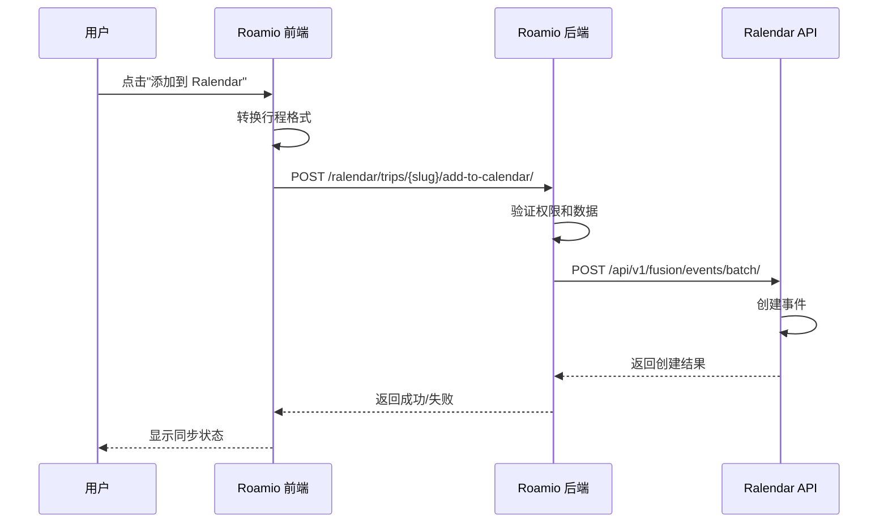

# 🗓️ Ralendar 集成功能文档

> **更新时间**: 2025-11-08  
> **状态**: ✅ 已实现

---

## 📋 功能概述

Roamio 与 Ralendar 日历系统的深度集成，允许用户将旅行计划中的行程安排同步到 Ralendar 日历，实现跨应用的日程管理和提醒功能。

---

## 🎯 核心功能

### 1️⃣ **旅行计划同步到日历**
- ✅ 一键将旅行行程添加到 Ralendar 日历
- ✅ 自动转换行程格式为日历事件
- ✅ 支持批量创建多个事件
- ✅ 保留行程的时间、地点、描述信息

### 2️⃣ **同步状态管理**
- ✅ 实时检查同步状态
- ✅ 显示已同步/未同步标识
- ✅ 支持移除已同步的事件

### 3️⃣ **数据双向同步**
- ✅ Roamio → Ralendar：旅行计划同步到日历
- 🔄 Ralendar → Roamio：日历事件回写（待实现）

---

## 🏗️ 技术架构

### **后端 API**

#### **1. Ralendar 集成 ViewSet**
```python
# backend/api/viewsets/ralendar_viewset.py

class RalendarIntegrationViewSet(ViewSet):
    """Ralendar 集成 API"""
    
    @action(detail=True, methods=['post'], url_path='add-to-calendar')
    def add_to_calendar(self, request, pk=None):
        """将旅行计划添加到 Ralendar 日历"""
        pass
    
    @action(detail=True, methods=['get'], url_path='calendar-events')
    def get_calendar_events(self, request, pk=None):
        """获取旅行计划关联的日历事件"""
        pass
    
    @action(detail=True, methods=['delete'], url_path='calendar-events')
    def delete_calendar_events(self, request, pk=None):
        """删除旅行计划关联的所有日历事件"""
        pass
```

#### **2. Ralendar API 客户端**
```python
# backend/utils/ralendar_client.py

class RalendarClient:
    """Ralendar API 客户端"""
    
    def create_event(self, user_token, event_data):
        """创建单个事件"""
        pass
    
    def batch_create_events(self, user_token, events_list, trip_slug):
        """批量创建事件"""
        pass
    
    def get_trip_events(self, user_token, trip_slug):
        """获取旅行事件"""
        pass
    
    def delete_trip_events(self, user_token, trip_slug):
        """删除旅行事件"""
        pass
```

### **前端组件**

#### **1. AddToCalendarButton 组件**
```vue
<!-- web/src/components/AddToCalendarButton.vue -->

<template>
  <div class="add-to-calendar">
    <!-- 添加到日历按钮 -->
    <button @click="handleAddToCalendar">
      添加到 Ralendar
    </button>
    
    <!-- 已同步状态 -->
    <div v-if="synced">
      <button disabled>已同步到日历</button>
      <button @click="handleRemoveFromCalendar">移除</button>
    </div>
  </div>
</template>
```

#### **2. Ralendar API 调用**
```javascript
// web/src/api/ralendar.js

export const addTripToCalendar = (tripSlug, events) => {
  return request.post(`/ralendar/trips/${tripSlug}/add-to-calendar/`, {
    events
  })
}

export const getTripCalendarEvents = (tripSlug) => {
  return request.get(`/ralendar/trips/${tripSlug}/calendar-events/`)
}

export const deleteTripCalendarEvents = (tripSlug) => {
  return request.delete(`/ralendar/trips/${tripSlug}/calendar-events/`)
}
```

---

## 📡 API 端点

### **1. 添加到日历**
```http
POST /api/v1/ralendar/trips/{trip_slug}/add-to-calendar/
Authorization: Bearer {access_token}
Content-Type: application/json

{
  "events": [
    {
      "title": "参观故宫",
      "start_time": "2025-11-20T09:00:00+08:00",
      "end_time": "2025-11-20T12:00:00+08:00",
      "location": "北京故宫",
      "latitude": 39.9163,
      "longitude": 116.3972,
      "email_reminder": true,
      "description": "游览故宫博物院"
    }
  ]
}
```

**响应**:
```json
{
  "success": true,
  "created_count": 1,
  "failed_count": 0,
  "details": {
    "created": [...],
    "failed": []
  }
}
```

### **2. 获取日历事件**
```http
GET /api/v1/ralendar/trips/{trip_slug}/calendar-events/
Authorization: Bearer {access_token}
```

**响应**:
```json
{
  "events": [
    {
      "id": 123,
      "title": "参观故宫",
      "start_time": "2025-11-20T09:00:00+08:00",
      "location": "北京故宫",
      "source_app": "roamio",
      "related_trip_slug": "beijing-trip-2025"
    }
  ]
}
```

### **3. 删除日历事件**
```http
DELETE /api/v1/ralendar/trips/{trip_slug}/calendar-events/
Authorization: Bearer {access_token}
```

**响应**:
```json
{
  "success": true,
  "deleted_count": 5
}
```

---

## 🔄 数据流程

### **添加到日历流程**



---

## 🎨 用户界面

### **旅行详情页**

```
┌─────────────────────────────────────────────┐
│ 🏠 返回                              ⬇️ 评论 │
├─────────────────────────────────────────────┤
│                                             │
│  【北京五日游】          [添加到 Ralendar]  │
│  探索古都的魅力                             │
│                                             │
├─────────────────────────────────────────────┤
│  📅 行程概览                                │
│  Day 1: 抵达北京，入住酒店                  │
│  Day 2: 参观故宫、天安门                    │
│  Day 3: 游览长城                            │
│  ...                                        │
└─────────────────────────────────────────────┘
```

### **已同步状态**

```
┌─────────────────────────────────────────────┐
│  【北京五日游】                             │
│  探索古都的魅力                             │
│                                             │
│  [✓ 已同步到日历]  [移除]                   │
└─────────────────────────────────────────────┘
```

---

## 🔐 权限控制

### **1. 用户认证**
- ✅ 必须登录才能使用同步功能
- ✅ 使用 JWT Token 进行身份验证
- ✅ Token 自动传递给 Ralendar API

### **2. 权限验证**
- ✅ 只能同步自己的旅行计划
- ✅ 只能查看/删除自己的日历事件
- ✅ 后端双重验证（Roamio + Ralendar）

---

## 📊 数据模型

### **旅行事件（TripEvent）**

```python
class TripEvent(models.Model):
    """旅行事件模型"""
    
    # 关联字段
    trip = models.ForeignKey(Trip, on_delete=models.CASCADE)
    user = models.ForeignKey(User, on_delete=models.CASCADE)
    
    # 基础字段
    title = models.CharField(max_length=200)
    description = models.TextField(blank=True)
    event_time = models.DateTimeField(null=True, blank=True)
    
    # 地点字段
    location_name = models.CharField(max_length=200, blank=True)
    location_address = models.CharField(max_length=500, blank=True)
    location_lat = models.DecimalField(max_digits=10, decimal_places=7, null=True)
    location_lng = models.DecimalField(max_digits=10, decimal_places=7, null=True)
    
    # 提醒字段
    reminder_enabled = models.BooleanField(default=False)
    reminder_time = models.DateTimeField(null=True, blank=True)
    reminder_method = models.CharField(max_length=20, default='email')
    
    # Ralendar 同步
    synced_to_ralendar = models.BooleanField(default=False)
    ralendar_event_id = models.IntegerField(null=True, blank=True)
    
    # 来源标记
    source_app = models.CharField(max_length=50, default='roamio')
    source_id = models.CharField(max_length=100, blank=True)
```

---

## 🧪 测试指南

### **1. 功能测试**

#### **测试添加到日历**
```bash
# 1. 登录 Roamio
# 2. 进入任意旅行详情页
# 3. 点击"添加到 Ralendar"按钮
# 4. 确认对话框，点击"确定"
# 5. 等待同步完成
# 6. 检查按钮状态变为"已同步到日历"
```

#### **测试移除事件**
```bash
# 1. 在已同步的旅行详情页
# 2. 点击"移除"按钮
# 3. 确认对话框，点击"确定"
# 4. 等待删除完成
# 5. 检查按钮状态恢复为"添加到 Ralendar"
```

### **2. API 测试**

```bash
# 测试添加到日历
curl -X POST https://yourdomain.com/api/v1/ralendar/trips/beijing-trip/add-to-calendar/ \
  -H "Authorization: Bearer YOUR_ACCESS_TOKEN" \
  -H "Content-Type: application/json" \
  -d '{
    "events": [
      {
        "title": "测试事件",
        "start_time": "2025-12-01T09:00:00+08:00",
        "location": "北京"
      }
    ]
  }'

# 测试获取事件
curl -X GET https://yourdomain.com/api/v1/ralendar/trips/beijing-trip/calendar-events/ \
  -H "Authorization: Bearer YOUR_ACCESS_TOKEN"

# 测试删除事件
curl -X DELETE https://yourdomain.com/api/v1/ralendar/trips/beijing-trip/calendar-events/ \
  -H "Authorization: Bearer YOUR_ACCESS_TOKEN"
```

---

## 🚀 部署步骤

### **1. 后端部署**

```bash
# 1. 拉取最新代码
cd ~/roamio
git pull

# 2. 安装依赖（如有新增）
pip install -r requirements.txt

# 3. 运行数据库迁移
python manage.py migrate

# 4. 重启 uWSGI
pkill -9 -f uwsgi
nohup uwsgi --ini cloud_settings/uwsgi.ini > logs/uwsgi.log 2>&1 &
```

### **2. 前端部署**

```bash
# 1. 构建前端
cd web
npm run build

# 2. 提交构建文件
git add dist/
git commit -m "build: update frontend build"
git push

# 3. 服务器拉取
cd ~/roamio
git pull
```

### **3. 配置 Ralendar API URL**

```python
# roamio/settings.py

# Ralendar API 配置
RALENDAR_API_URL = 'https://app7626.acapp.acwing.com.cn/api/v1'
```

---

## 🐛 常见问题

### **Q1: 添加到日历失败，提示"未找到用户认证信息"**
**A**: 请确保已登录，并且 JWT Token 有效。尝试重新登录。

### **Q2: 同步后在 Ralendar 中看不到事件**
**A**: 检查以下几点：
1. Ralendar API 是否正常运行
2. 网络连接是否正常
3. 查看后端日志 `logs/uwsgi.log` 中的错误信息

### **Q3: 移除事件后，Ralendar 中还有事件**
**A**: 这可能是 Ralendar API 的延迟问题，稍等片刻刷新 Ralendar 页面。

### **Q4: 行程时间格式不正确**
**A**: 确保旅行配置中的时间格式为 ISO 8601 格式（`YYYY-MM-DDTHH:MM:SS+08:00`）。

---

## 🔮 未来优化

### **短期（1-2 周）**
- [ ] 支持自定义事件提醒时间
- [ ] 支持选择性同步（勾选要同步的行程）
- [ ] 添加同步进度条

### **中期（1-2 月）**
- [ ] 双向同步：Ralendar 事件回写到 Roamio
- [ ] 支持编辑已同步的事件
- [ ] 批量操作：一键同步所有旅行

### **长期（3-6 月）**
- [ ] 智能提醒：根据地点和天气自动调整
- [ ] 协作功能：多人共享旅行日历
- [ ] 数据分析：旅行时间统计和可视化

---

## 📞 技术支持

- **项目地址**: https://github.com/ppshuX/roamio
- **Ralendar 项目**: https://app7626.acapp.acwing.com.cn
- **问题反馈**: GitHub Issues

---

**最后更新**: 2025-11-08  
**文档版本**: v1.0

